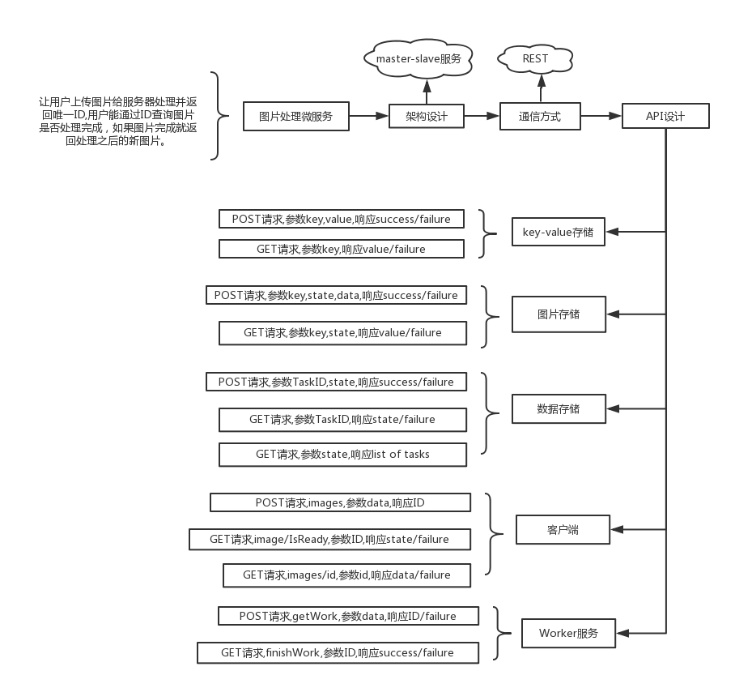

# 用Golang写一个微服务架构DEMO


微服务列表：

 * Key-Value
 * 存储任务的数据库
 * 文件储存
 * Master
 * Worker
 * 前端

其中Key-Value是用来存储微服务地址的，各个微服务之间使用http通信。下载代码到本地编译，运行命令：

```shell
./imagehandler_kv
./imagehandler_database localhost:3001 localhost:3000
./imagehandler_filesystem localhost:3002 localhost:3000
./imagehandler_master localhost:3003 localhost:3000
./imagehandler_worker localhost:3000 2
./imagehandler_frontend localhost:3000
```

启动第五个微服务命令中2是指同时开几个线程，你可以根据你的机器进行配置。访问localhost:8080即可操作。还有别忘了更改filesystem里面的baseImageDirectory路径。